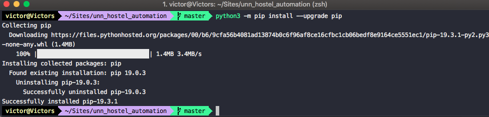
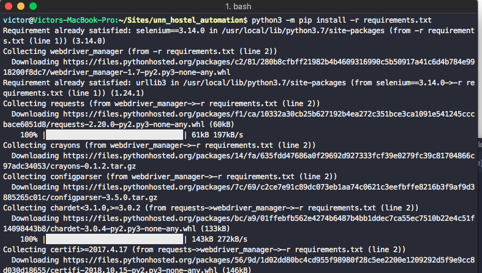
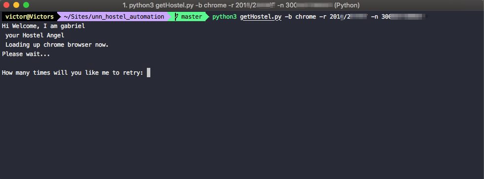
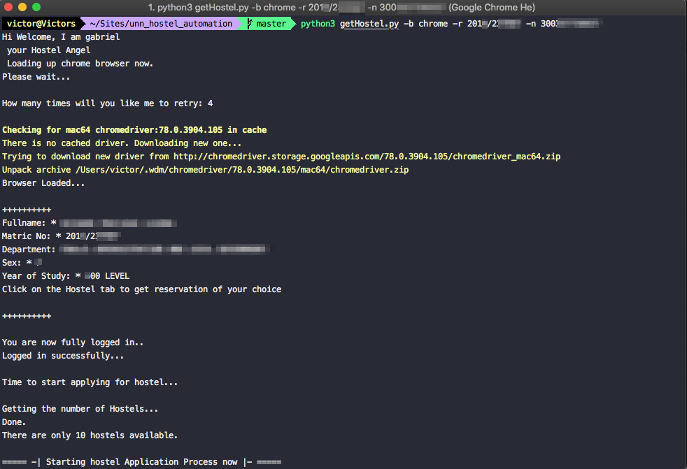
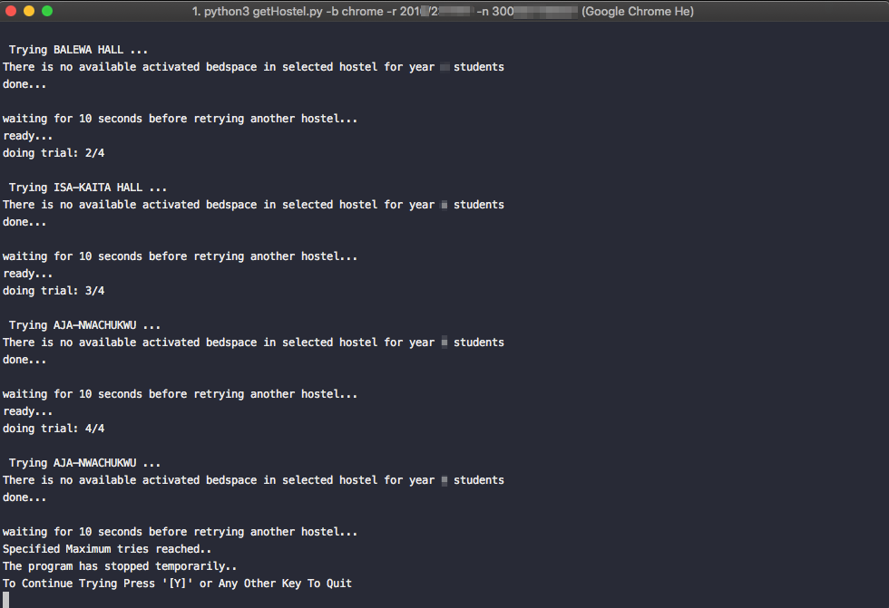
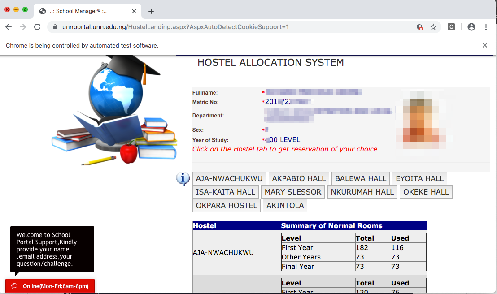
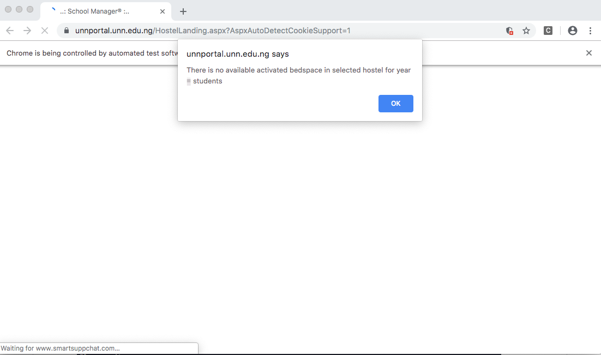

# University of Nigeria, Nsukka Hostel Automation
This is a simple automation tool that allows user students to apply, for hostel space in the hostel portal.

## Requirements 
- Make sure you have ```python3``` setup on your system
- Browser (Firefox or Chrome) [Firefox preferrable]
- If you will use chrome, you need to make sure your Chrome browser is updated

## Installation 
- Clone this repository
- Enter the repository/folder in your terminal

- Please Note(For windows users with only one version of python on their system):

        Replace 'python3' with 'python' in any of the following command below:
- Update your pip version
```python3 -m pip install --upgrade pip```

- Install the required modules, by running
``` python3 -m pip install -r requirements.txt --user``` 


## Running the program
```python3 getHostel.py -b [name of browser- 'firefox' or 'chrome'] -r ['school_regnum' of someone yet to get hostel] -n ['valid remitta rrr that has paid for the service']```

e.g 
- ```python3 getHostel.py -b chrome -r 2013/223xxx -n 344xxx89xx ```


- Console View 1

- Console View 2

- Browser View 1

- Browser View 2


- If you want to run the Program in headless mode (without browser)

``` python3 getHostel.py -b [name of browser- 'firefox' or 'chrome'] -r ['school_regnum' of someone yet to get hostel] -n ['valid remitta rrr that has paid for the service'] -nb [(as in no-browser) run in headless mode - 'true' or 'false'] ```

e.g.
``` python3 getHostel.py -b chrome -r 2013/223xxx -n 344xxx89xx -nb true ```

## To See help Page
```
python3 getHostel.py -h/--help
```
